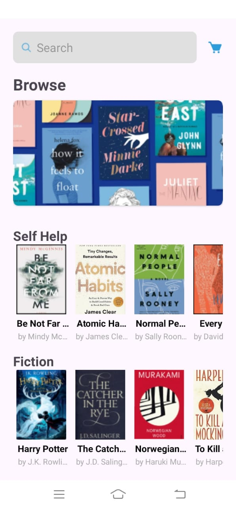
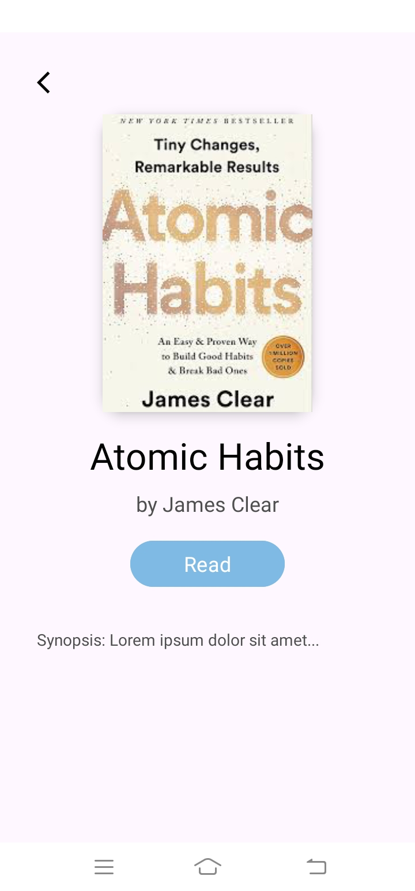
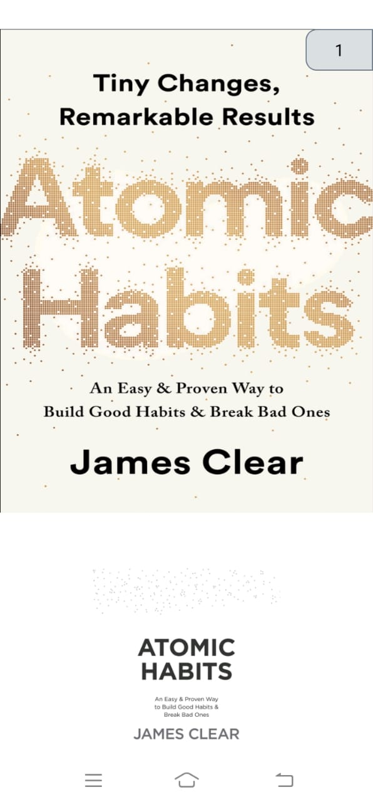

# UTS - Pertemuan ke 8
# Tugas Pertemuan ke 8 { UTS }

| **Nama**                    | Fadzar Surya Wijaya             |
|----------------------------|--------------------------------|
| **NIM**                    | 312310451                      |
| **Kelas**                  | TI.23.A5                       |
| **Mata Kuliah**            | Pemograman Mobile 1            |
| **Dosen Pengampu**         | Donny Maulana, S.Kom., M.M.S.I |
 

# ***BACAKU*** 
### Digital Reading Platform

## Contents
1. [Overview](#overview)
2. [Demo Video](#demo)
3. [Screenshots](#screenshots)
4. [Credit](#credit)

# Overview
### Bacaku
**Bacaku** is an open-source platform designed to digitize and simplify the process of reading books for free. It's currently under development and welcomes contributions from the community to enhance its capabilities.

# Demo

  <video width="560" height="315" controls>
    <source src="img/DemoBacaku.mp4" type="video/mp4">
    Your browser does not support the video tag.
  </video>

### Key Features:
- **Digital Book Storage**: Upload and store electronic books, making them accessible anytime and anywhere.
- **User Profiles**: Each user has a profile showcasing their book collection and current reading status.
- **Book Recommendations**: Intelligent algorithms provide book recommendations based on user interests and reading history.

### Technology Stack:
- **Backend**: PHP with MySQL for database management and API functionalities.
- **Frontend**: User-friendly, responsive design for a seamless reading experience.
- **Mobile**: Android application using Glide to load images and maintain user book profiles.
 

# Screenshots:
### Home Page

  

### BookInformation Page

  

### Reader Page

  

# Credit by

<i>Dibuat oleh Fadzar Surya Wijaya<i> 
<i>TI.23.A5 (312310451)<i> 
<i>Universitas Pelita Bangsa<i>

## License

All associated resources are licensed under the [MIT License](https://mit-license.org/).

## Post Script
Join us in advancing Bacaku, an open-source project aimed at making free book reading accessible to everyone! 🚀😊

