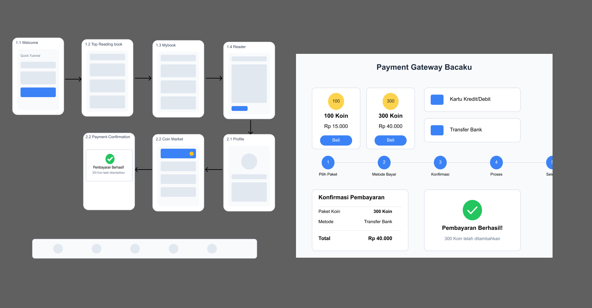

# UTS - Pertemuan ke 8
# Tugas Pertemuan ke 8 { UTS }

| **Nama**                    | Fadzar Surya Wijaya             |
|----------------------------|--------------------------------|
| **NIM**                    | 312310451                      |
| **Kelas**                  | TI.23.A5                       |
| **Mata Kuliah**            | Pemograman Mobile 1            |
| **Dosen Pengampu**         | Donny Maulana, S.Kom., M.M.S.I |


# ***BACAKU*** 
### Platform Membaca Digital dengan Sistem Koin Pintar


## Daftar Isi
1. [Pendahuluan](#pendahuluan)
2. [Identitas Merek](#identitas-merek)
3. [Halaman](#halaman)
4. [Panduan Gaya](#panduan-gaya)
5. [StoryBoard & Mockup](#mockup-dan-storyboard)
6. [Implementasi](#implementasi)
7. [Instalasi](#instalasi)

## Pendahuluan
Bacaku adalah platform membaca digital inovatif yang merevolusi pengalaman membaca ebook melalui sistem pembayaran berbasis koin. Platform kami menawarkan fleksibilitas dalam pembelian dan membaca buku, memungkinkan pengguna mengelola biaya membaca mereka secara efisien sambil menikmati konten berkualitas tinggi.

## Identitas Merek

### Palet Warna
- **Warna Utama:**
  - Biru Utama: `#2F80ED`
  - Biru Sekunder: `#7FBAE4`
  - Tema Gelap: `#322F35`
  - Gradien: Linear(`#0056B3`, `#007BFF`)

- **Warna Teks:**
  - Teks Utama: `#000000`
  - Teks Sekunder: `#4F4F4F`
  - Teks Tersier: `#606060`
  - Teks Nonaktif: `#BDBDBD`, `#CECECE`
  - Abu-abu Tambahan: `#828282`, `#7E7E7E`

### Tipografi
- **Font Utama:**
  - Helvetica Neue LT Pro
  - Arial
- **Font Sekunder:**
  - Cambria
  - Georgia
- **Penggunaan Khusus:**
  - Source Code Pro (Extra Bold)
  - Zain
  - Paytone One

## Halaman

### 1. Alur Autentikasi
- Layar Splash
- Antarmuka Login
- Proses Pendaftaran

### 2. Navigasi Utama
- **Halaman Beranda**
  - Fungsi pencarian
  - Navigasi kategori
  - Konten unggulan
  - Bagian penjualan terbaik

- **Buku Saya**
  - Koleksi buku
  - Lanjutkan membaca

- **Antarmuka Membaca**
  - Tampilan konten
  - Toggle mode malam
  - Kontrol navigasi

### 3. Fitur Komersial
- **Antarmuka Toko**
  - Daftar buku
  - Tampilan harga
  - Opsi pembelian
  - Pengelolaan keranjang

- **Alur Pembayaran**
  - Pembelian koin
  - Pemilihan metode pembayaran
  - Integrasi QRIS
  - Konfirmasi transaksi

## Panduan Gaya
- Mengikuti prinsip Material Design
- Menjaga konsistensi spasi
- Menggunakan konstanta warna yang telah ditentukan
- Menerapkan pola desain responsif

## Mockup dan StoryBoard
### Mockup

### Story Board

***Signin & Signup*** :<br>
•	Sign In Screen: Pengguna memasukkan email dan password, kemudian klik tombol "Sign In" untuk masuk ke aplikasi.<br>
•	Sign Up Screen: Pengguna yang belum memiliki akun bisa melakukan pendaftaran dengan memasukkan email dan password, kemudian klik "Sign Up".<br>
***Mybook Screen***:<br>
•	Daftar Buku Saya: Menampilkan daftar buku yang sudah dimiliki atau sedang dibaca pengguna, dengan tampilan progres membaca (misalnya "70% dibaca").<br>
***Profile Screen***:<br>
•	Informasi Profile: Tampilkan nama pengguna, deskripsi, dan gambar profil.
•	Opsi Lainnya: Fitur saldo koin dan tambah koin untuk navigasi ke halaman topup


## Implementasi
### 1. Halaman Login

***keterangan***: Pengguna dapat ```Sign-up``` terlebih dahulu dan login dengan akun yang sudah dibuat.
### 2. Halaman Home

***keterangan***: Berbagai macam buku ditemukan disini dengan berbagai pilihan kategori yang berbeda. Tekan ```Browse``` untuk ke halaman Top Sellers.
### 3. Halaman Top Sellers

***keterangan***: Buku yang sering diminati untuk dibaca menurut ```sumber terpercaya```.
### 4. Halaman Profile

***keterangan***: Penggunan bisa mengubah ```foto dan lokasi dirinya berada```.
### 5. Halaman Topup

***keterangan***: Menu topup koin dengan tawaran menarik. ```koin merupakan syarat untuk purchase ebook```.
### 6. Halaman Konfirmasi

***keterangan***: estimasi waktu yang berlaku dan metode pembayaran baru bisa menggunakan ```qris```.
### 7. Qris

***keterangan***: akses pembayaran dengan scanning barcode untuk memudahkan pengguna dan juga telah diberikan ```prosedur keterangan``` yang memadai
## Instalasi

1. Klon repositori
```bash
git clone https://github.com/FadzarSuryaWijaya/UTS-PemogramanMobile1
```

2. Konfigurasi android Studio
```bash
Buka Android Studio
Pilih "Open an Existing Project"
Arahkan ke direktori project ```LBACAKU```
Tunggu proses indexing dan sync Gradle selesai
```

3. Konfigurasi gradle
```bash
plugins {
    id("com.android.application")
}

android {
    namespace = "com.example.lbacaku"
    compileSdk = 34

    defaultConfig {
        applicationId = "com.example.lbacaku"
        minSdk = 24
        targetSdk = 34
        versionCode = 1
        versionName = "1.0"

        testInstrumentationRunner = "androidx.test.runner.AndroidJUnitRunner"
        vectorDrawables.useSupportLibrary = true
    }

    buildTypes {
        release {
            isMinifyEnabled = false
            proguardFiles(getDefaultProguardFile("proguard-android-optimize.txt"), "proguard-rules.pro")
        }
    }
    compileOptions {
        sourceCompatibility = JavaVersion.VERSION_1_8
        targetCompatibility = JavaVersion.VERSION_1_8
    }
}

dependencies {

    implementation("androidx.appcompat:appcompat:1.6.1")
    implementation("com.google.android.material:material:1.8.0")
    implementation("androidx.constraintlayout:constraintlayout:2.1.4")
    testImplementation("junit:junit:4.13.2")
    androidTestImplementation("androidx.test.ext:junit:1.1.5")
    androidTestImplementation("androidx.test.espresso:espresso-core:3.5.1")
}
```

4. Menjalankan Layout
```bash
Pilih device target (emulator/real device)
Klik tombol "Run" (⇧+F10) atau "Debug" (⇧+F9)
```

---

## Kredit
***Dibuat oleh Fadzar Surya Wijaya***<br>
***TI.23.A5 (312310451)***<br>
***Universitas Pelita Bangsa***


## Lisensi
<p font face="Times New Roman">All associated resources are licensed under the [MIT License](https://mit-license.org/).</p>

# Finished! 🎉